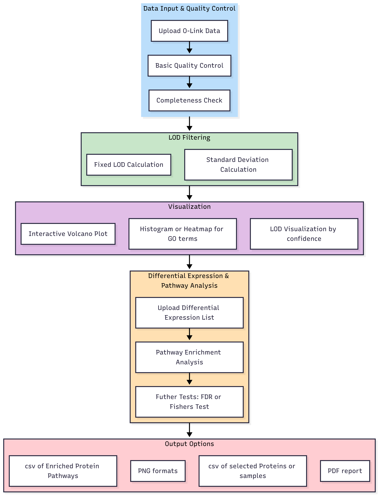

# ProteO-Linker
ProteO-Linker is a web-based protein expression analysis tool. It uses a Shiny interface built in R to examine [O-Link](https://olink.com/) data generated by their proteomics platform. Users are able to upload their data and a generate custom plots of expression data.

# Pathway Enrichment Analysis Pipeline

## Overview & Objective
## Methodology
** QC of input files **
For each parquet file uploaded, two checks are run.  1) Check to make sure file is complete and formatted correctly
2) Inform user of Failed or Warned Samples or Assays in each parquet file

** LOD **
The user has the option of filtering the data by LOD
Two methods are available:  1) Fixed LOD   2) Standard Deviation based LOD

If user selects this, a volcan plot of all 6 sample controls will be available to download that visualizes what is above and below LOD

** DE analysis **

## Workflow

## Breakdown of steps and options

## Future Directions and Conclusion

**Conclusion:**

## Contributors: 

- Kimberly Walker, BCM (Team Leader)
- Tomilola Aderupoko,
- Vijetha Balakundi,
- Neda Ghohabi Esfahani,  
- Michael Muchow, DMV Petri Dish
- Aniket Naik, 
- Qiaoyan Wang, BCM

## Common Acronyms
Abbreviation  | Acronym
------------- | -------------
ANOVA  | Analysis of Variance
LOD | Limit of Detection
LOQ | Limit of Quantification
NPX | Normalized Protein eXpression
PEA | Proximity Extension Assay 

## NCBI Codeathon Disclaimer
This software was created as part of an NCBI codeathon, a hackathon-style event focused on rapid innovation. While we encourage you to explore and adapt this code, please be aware that NCBI does not provide ongoing support for it.
