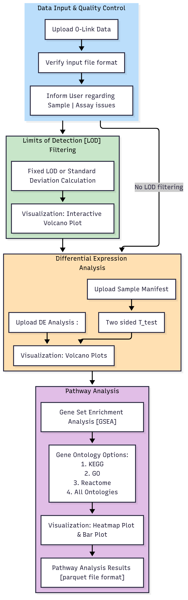

# ProteO-Linker
ProteO-Linker is a web-based protein expression analysis tool. It uses a Shiny interface built in R to examine [O-Link](https://olink.com/) data generated by their proteomics platform. Users are able to upload their data and a generate custom plots of expression data.

## How to Use

1. **Clone the repository**
   ```bash
   git clone https://github.com/collaborativebioinformatics/Proteolinker.git
   cd Proteolinker
   ```

2. **Install dependencies**

   Make sure you have R (≥ 4.0) and Shiny installed.

   Install required packages from within R:
   ```r
   install.packages(c("shiny", "ggplot2", "dplyr", "tidyr", "readr", "ComplexHeatmap"))
   ```

3. **Launch the app**

   From R or RStudio, run:
   ```r
   shiny::runApp("app.R")
   ```
4. **Upload data**
   - Select your Olink NPX or parquet file(s)
   - Run QC and LOD filtering (optional)
   - (Optional) Upload a differential expression (DE) list

5. **Explore results**
   - Generate histograms, heatmaps, and volcano plots
   - Run pathway enrichment analysis
   - Download plots (PNG) or results (CSV/PDF)

# Pathway Enrichment Analysis Pipeline

## Overview & Objective

The goal of ProteO-Linker is to provide a straightforward workflow for examining protein expression data generated by Olink assays. The tool performs quality checks, applies filtering, and supports downstream analysis such as differential expression and pathway enrichment. Users can visualize results through multiple plot types and export figures or tables for reporting. The objective is to lower the barrier for exploratory analysis of Olink data while keeping the workflow modular and easy to adapt.

## Methodology

ProteO-Linker implements a stepwise pipeline:

1. **Quality Control (QC) of Input Files**
   - For each uploaded parquet file, two checks are performed:
     1. Verify that the file is complete and correctly formatted  
     2. Report failed or warned samples/assays  
   - Provides users with a summary of QC status for each file  

2. **LOD Filtering**
   - Two filtering methods are available:
     1. Fixed LOD (values provided by Olink)  
     2. Standard deviation–based LOD (customizable, current default is 3 SD from mean)  
   - If applied, a volcano plot of all 6 sample controls is generated, showing proteins above and below LOD  

3. **Differential Expression (DE) Analysis**
   - Users may upload a list of differentially expressed proteins with DE analysis
   - Or the app will do DE analysis, users need to upload a manifest: male vs. female, treated vs. nontreated
   - DE will be done via ttest or LMER  
   - DE results can be visualized with volcano plots (protein name, fold-change, p-value)  
   - These outputs will be used as input for pathway enrichment  

4. **Pathway Enrichment**
   - Enrichment analysis highlights pathways associated with significant proteins  
   - Will use GSEA; additional methods (FDR, Fisher’s test) planned for future development  

5. **Visualization**
   - Histograms/heatmaps of protein expression linked to GO terms  
   - Confidence-based visualization of LOD filtering results  
   - Interactive volcano plots for DE analysis  

6. **Outputs**
   - PNG plots for visualization  
   - CSV files of selected proteins, samples, or enriched pathways  
   - Optional PDF report summarizing results  

## Workflow


## Conclusion:

## Future Directions and Conclusion

     
## Contributors: 

- Kimberly Walker, BCM (Team Leader)
- Tomilola Aderupoko,
- Vijetha Balakundi,
- Neda Ghohabi Esfahani,  
- Michael Muchow, DMV Petri Dish
- Aniket Naik, 
- Qiaoyan Wang, BCM

## Common Acronyms
Abbreviation  | Acronym
------------- | -------------
ANOVA  | Analysis of Variance
LOD | Limit of Detection
LOQ | Limit of Quantification
NPX | Normalized Protein eXpression
PEA | Proximity Extension Assay 

## NCBI Codeathon Disclaimer
This software was created as part of an NCBI codeathon, a hackathon-style event focused on rapid innovation. While we encourage you to explore and adapt this code, please be aware that NCBI does not provide ongoing support for it.
